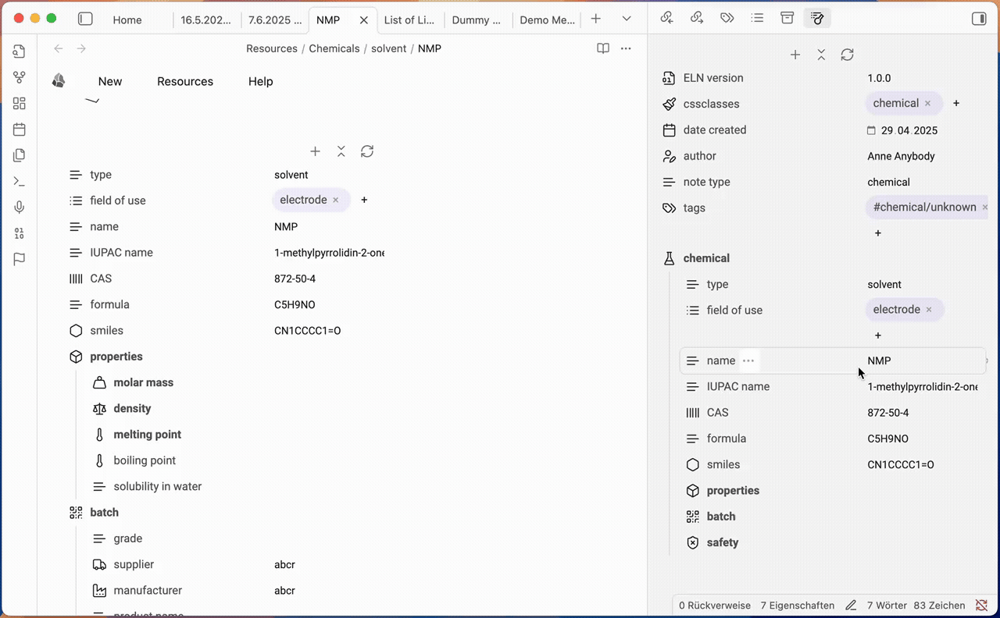
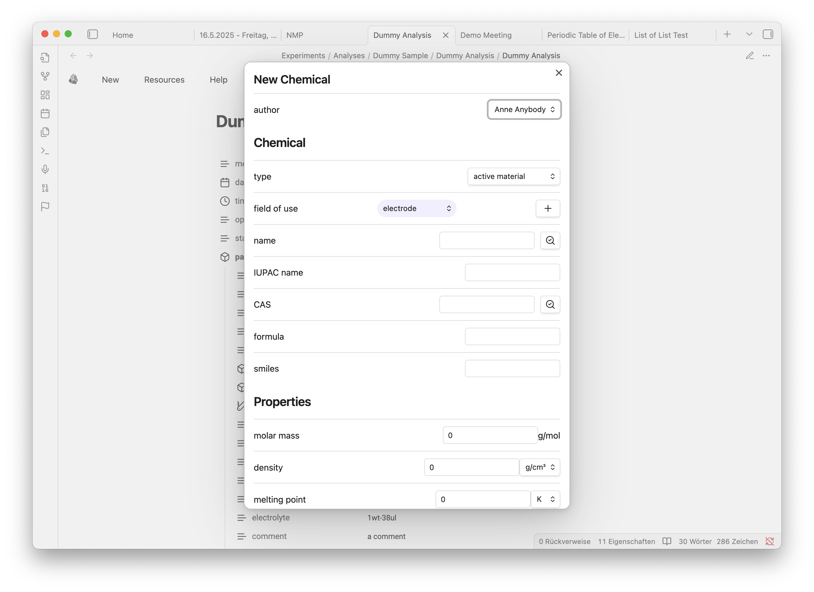
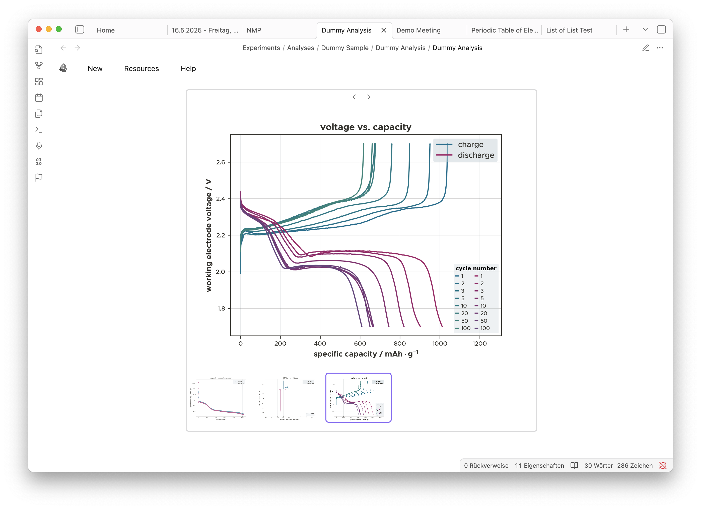
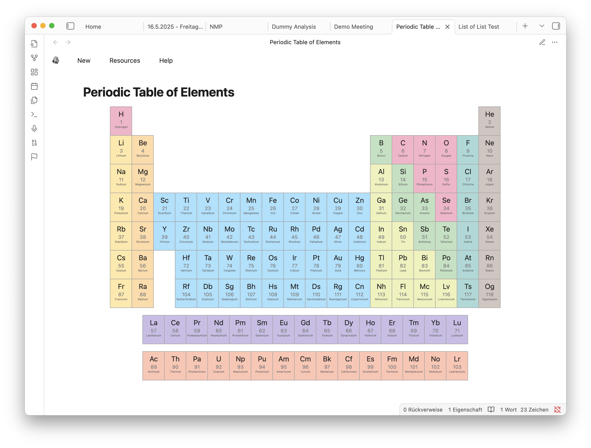

# obsidian-eln-plugin
Elctronic Lab Notebook Plugin for Obsidian

This is the home of the new Obsidian ELN plugin. The plugin integrates most the functionality of the obsidian-eln-vault project into an obsidian plugin and at the same time add new features and improvments which had previously not been possible with the srcipt based approach of the eln-vault. However, the ELN vault will exist further to provide a preconfigured vault including also other plugins relevant for reserachers for literature managment or exporting reports or manuscripts to Word or PDF.

**Warning:** The current version of the plugin is still an early pre-release and serves as a technology preview. Some of the features are not yet functional.

## Features

### Nested properties editor
For editing the nested metadata of the ELN the plugin provides an editor that lets you edit, add and remove properties of your metadata.

### New dialogs for note creation

### Integrated image viewer

### Interactiv periodic table of elements

