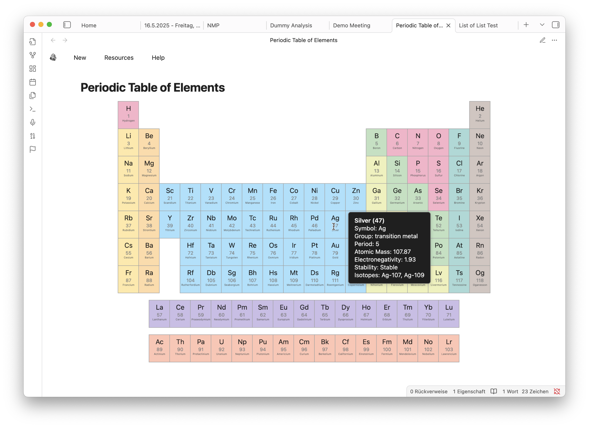

# Obsidian ELN Plugin

[](https://github.com/fcskit/obsidian-eln-plugin/releases)
[](LICENSE)
[](https://github.com/fcskit/obsidian-eln-plugin/releases)

Electronic Lab Notebook (ELN) functionality integrated seamlessly into Obsidian. Transform your Obsidian vault into a powerful, structured laboratory notebook with dynamic templates, metadata management, and specialized research tools.

> **⚠️ Beta Release**: This plugin is currently in public beta. Core features are stable, but expect some rough edges. Please [report issues](https://github.com/fcskit/obsidian-eln-plugin/issues) and backup your vault before use!

## ✨ Features

- 🔬 **Dynamic Note Templates** - Create structured lab notes with intelligent forms
- 🧪 **Chemical Integration** - Built-in chemical structure lookup and periodic table
- 📊 **Metadata Management** - Rich, nested metadata with automatic validation
- 🎨 **Modern UI** - Clean, intuitive interface that matches Obsidian's design
- 🔄 **Reactive Fields** - Template fields that update automatically based on other inputs
- 📋 **Flexible Templates** - JSON-based templates that are easy to customize
- 📈 **Dashboard & Tracking** - Monitor research progress and organize projects

## 🚀 Quick Start

### Installation

> **📦 Beta Installation**: Currently available via test vault, BRAT, or manual installation. Community plugin store submission coming after beta testing.

**Method 1: Test Vault (Easiest - Try Before Installing)**

Perfect for testing the plugin with example notes before adding to your own vault:

1. **Download the test vault**
   - Go to [GitHub Releases](https://github.com/fcskit/obsidian-eln-plugin/releases)
   - Download `obsidian-eln-test-vault.zip`

2. **Extract and open in Obsidian**
   - Extract the zip file
   - Open Obsidian → "Open folder as vault"
   - Navigate to the extracted folder
   - **⚠️ IMPORTANT**: Select the folder that **CONTAINS** the `.obsidian` folder!
     - Some unzip tools create a parent folder (e.g., `test-vault/test-vault/`)
     - You need to open the **inner** folder, not the outer one
     - Look for the folder with `.obsidian` directory inside

3. **Start exploring**
   - Plugin is pre-installed and configured
   - Includes example notes for all template types
   - Assets folder included for full visual experience

**Method 2: BRAT (Recommended for Existing Vaults)**

⚠️ **Warning**: This is a beta plugin. Only recommended if you:
- Have backups of your vault
- Understand the risks of beta software
- Are comfortable troubleshooting issues
- Can tolerate potential data loss or corruption

The easiest way to add to an existing vault with automatic updates:

1. **Backup your vault first!** (seriously, do this)

2. **Install BRAT plugin**
   - Open Obsidian → Settings → Community plugins
   - Search for "BRAT" and install it

3. **Add ELN Plugin**
   - Open command palette (`Ctrl/Cmd+P`)
   - Type "BRAT: Add a beta plugin for testing"
   - Enter: `fcskit/obsidian-eln-plugin`
   - Enable the plugin in Settings → Community plugins

4. **Done!** BRAT will auto-update when new betas release

📚 [Detailed BRAT Installation Guide](./docs/user/BRAT-INSTALLATION.md)

**Method 3: Manual Installation**

For users who prefer manual control:

1. **Download the latest release**
   - Go to [GitHub Releases](https://github.com/fcskit/obsidian-eln-plugin/releases)
   - Download `obsidian-eln-0.7.0-beta.1.zip`

2. **Extract to your vault**
   - Navigate to your vault's `.obsidian/plugins/` folder
   - Create folder: `.obsidian/plugins/obsidian-eln/`
   - Extract the zip contents into this folder

3. **Enable the plugin**
   - Open Obsidian → Settings → Community plugins
   - Enable "Electronic Lab Notebook"

**Method 4: Install from Source**

For developers or advanced users who want to build from source:

1. **Clone the repository**
   ```bash
   git clone https://github.com/fcskit/obsidian-eln-plugin.git
   cd obsidian-eln-plugin
   ```

2. **Install dependencies**
   ```bash
   npm install
   ```

3. **Build the plugin**
   ```bash
   npm run build
   ```

4. **Copy to your vault**
   ```bash
   # Copy to your vault's plugin folder
   cp main.js manifest.json styles.css /path/to/your/vault/.obsidian/plugins/obsidian-eln/
   ```

5. **Enable the plugin**
   - Reload Obsidian
   - Settings → Community plugins → Enable "Electronic Lab Notebook"

**Requirements**
- Obsidian 0.15.0 or higher
- Desktop recommended (mobile support experimental)

**Recommended Companion Plugins**

For the best experience, install these community plugins:

- **[Dataview](https://github.com/blacksmithgu/obsidian-dataview)** - Enables dynamic list generation in project notes and other templates
- **[Pixel Banner](https://github.com/jparkerweb/obsidian-pixel-banner)** - Display banner images for daily notes and project notes  
- **[Chem](https://github.com/Acylation/obsidian-chem)** - Renders chemical structures (SMILES strings) in chemical templates

**Optional: Assets Package**

If using Method 2, 3, or 4, you may want the assets package for full template rendering with images:

1. Download `obsidian-eln-assets.zip` from the [latest release](https://github.com/fcskit/obsidian-eln-plugin/releases)
2. Extract to your vault root (creates `assets/` folder)
3. Templates will now display images correctly for projects, devices, contacts, and daily notes

*Note: Test vault (Method 1) already includes the assets folder.*

**⚠️ Important**: Always backup your vault before installing beta software!

### First Steps

1. **Create Your First Note**: Use `Ctrl/Cmd+P` → "ELN: Create Note"
2. **Choose a Template**: Try "Basic Experiment" or "Chemical"
3. **Fill the Form**: Enter your research data in the structured form
4. **Explore Features**: Try different templates and customization options

## 📖 Documentation

### 👥 For Users
- **[Installation Guide](./docs/user/installation.md)** - Complete setup instructions
- **[Features Overview](./docs/user/features.md)** - All plugin capabilities
- **[Template System](./docs/user/template-system.md)** - Understanding and customizing templates
- **[Template Examples](./docs/user/template-examples/)** - Ready-to-use templates

### 🔧 For Developers
- **[Architecture Overview](./docs/developer/architecture.md)** - System design and components
- **[Development Setup](./docs/developer/development-setup.md)** - Environment setup
- **[API Reference](./docs/developer/api-reference.md)** - TypeScript interfaces and APIs
- **[Contributing Guide](./docs/developer/contributing.md)** - How to contribute

## 🎯 Use Cases

### Academic Research
- Experiment documentation and tracking
- Literature review organization  
- Research proposal development
- Thesis and dissertation writing

### Industry R&D
- Product development tracking
- Quality control documentation
- Regulatory compliance
- Patent documentation

### Educational Settings
- Student lab reports
- Course experiment tracking
- Teaching material development

## 🏗️ Project Structure

```
obsidian-eln-plugin/
├── src/                    # Source code
│   ├── main.ts            # Plugin entry point
│   ├── core/              # Core business logic
│   ├── ui/                # User interface components
│   └── utils/             # Utilities and helpers
├── docs/                  # Documentation
│   ├── user/              # User guides
│   ├── developer/         # Developer documentation
│   └── examples/          # Template examples
├── tests/                 # Test files
├── images/                # Screenshots and assets
└── release/               # Built plugin files
```

## 🛠️ Development

### Prerequisites
- Node.js 16+ and npm
- TypeScript knowledge
- Obsidian for testing

### Setup
```bash
git clone https://github.com/fcskit/obsidian-eln-plugin.git
cd obsidian-eln-plugin
npm install
npm run dev
```

### Available Scripts
- `npm run dev` - Development build with watch mode
- `npm run build` - Production build
- `npm run test` - Run tests
- `npm run build-css` - Compile modular CSS

See [Development Setup](./docs/developer/development-setup.md) for detailed instructions.

## 📸 Screenshots

### Note Creation Dialog


### Nested Properties Editor


### Integrated Image Viewer


### Periodic Table Integration


## 🤝 Contributing

We welcome contributions! Please see our [Contributing Guide](./docs/developer/contributing.md) for details.

### Ways to Contribute
- 🐛 **Bug Reports** - Help us identify and fix issues
- 💡 **Feature Requests** - Suggest new functionality
- 📝 **Documentation** - Improve guides and examples
- 🔧 **Code Contributions** - Implement features and fixes
- 🧪 **Testing** - Help test new features and releases

## 📄 License

This project is licensed under the MIT License - see the [LICENSE](LICENSE) file for details.

## 🔗 Links

- **[GitHub Repository](https://github.com/fcskit/obsidian-eln-plugin)**
- **[Issue Tracker](https://github.com/fcskit/obsidian-eln-plugin/issues)**
- **[Discussions](https://github.com/fcskit/obsidian-eln-plugin/discussions)**
- **[Releases](https://github.com/fcskit/obsidian-eln-plugin/releases)**

## 🙏 Acknowledgments

This project builds upon the excellent work of the Obsidian community and integrates functionality previously available in the obsidian-eln-vault project, now enhanced with plugin-specific capabilities.

### Credits

- **Footer Implementation**: Inspired by [Rich Foot plugin](https://github.com/jparkerweb/rich-foot) by jparkerweb
- **Development**: This plugin was developed with AI assistance (GitHub Copilot and Claude)

---

**Version**: 0.7.0-beta.1 | **Status**: Public Beta | **Last Updated**: January 27, 2026

## 📢 Beta Feedback

This is a **beta release**! We need your feedback to make it better:

- 🐛 **Found a bug?** [Report it here](https://github.com/fcskit/obsidian-eln-plugin/issues/new)
- 💡 **Have a suggestion?** [Start a discussion](https://github.com/fcskit/obsidian-eln-plugin/discussions)
- ⭐ **Like the plugin?** Give us a star on GitHub!

Your feedback helps shape the future of this plugin. Thank you for being an early adopter!

---

### Interactive Periodic Table of Elements


